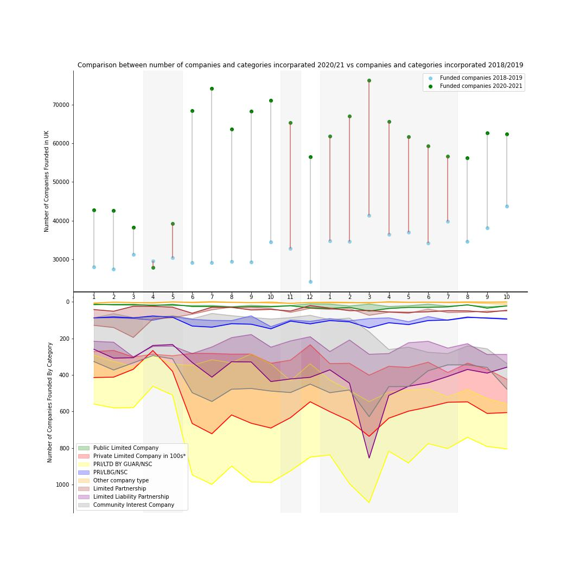
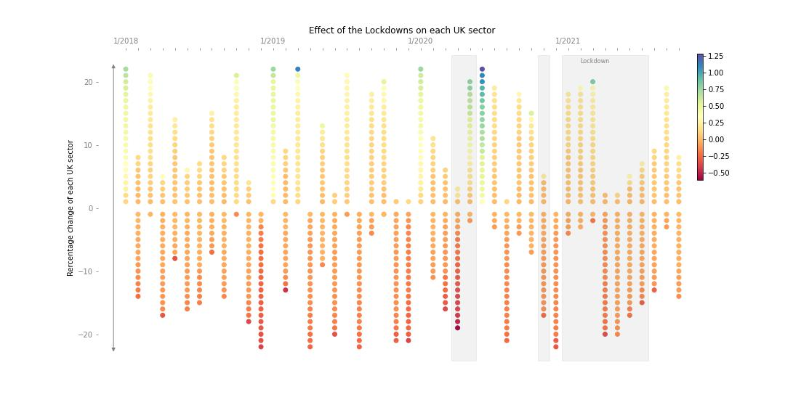

## About this project

In this repository there are 3 static visualizations that presented the impact of the pandemic on business foundation patterns. More specifically, the analysis examines the effects of the 3 lockdowns on companies incorporated in United Kingdom. 

1. The first graph illustrates how the 3 lockdowns affect the number of companies incorporated from January 2018 until November 2021 along with the fluctuation of the basic categories of incorporations. 
2. The second graph displays the effect of the lockdowns in the 22 sectors in UK. In order to capture this effect the monthly percentage change of each sector was taken and ordered based on that change. 
3. The third graph shows the allocation of newly formed companies in 10 areas the months without and during lockdowns in the period 2018-2021. 

## Dataset

The data repository of Companies House provides a Free Company Data Product which is a downloadable data snapshot containing basic company data of live companies on the register. You can access this site [here](http://download.companieshouse.gov.uk/en_output.html).

The dataset was downloaded in CSV format on 01/11/2021.

## Main python libraries used

1.	Pandas for data importing and cleaning 
2.	Numpy for data aggregation 
3.	Matplotlib’s pyplot for static plots 

## Results

### 1st Graph

The first graph illustrates how the 3 lockdowns affect the number of companies incorporated from January 2018 until November 2021 along with the fluctuation of the basic categories of incorporations.

It can be seen that in the beginning of the first lockdown on April 2020 the number of companies incorporated was slightly lower than the ones incorporated on April 2018. However from there a bounce back was noticed in foundation of companies, with the difference between the 2 years to pick on March 2021, in the middle of the second lockdown. The same trend seems to follow the categories of the companies with the most affected one be the PRI/LBG/NSC which was the only one performed worst from the previous 2 years.

### 2nd Graph

The second graph displays the effect of the lockdowns in the 22 sectors in UK. In order to capture this effect the monthly percentage change of each sector was taken and ordered based on that change.

Based on graph, the first month of Covid-19 affected the majority of the sectors probably due to the uncertainty regarding the virous. However the next 2 months all the sectors increased leading to the highest percentage changes in these 4 years. The opposite effect seems to appeared on the second lockdown which leads in a drop of all sectors, and despite the percentage increases of the first months of 2021, the majority of the sectors experience a recession.

## Conclusion

Based on the above graphs, the pandemic seems not to affect much the foundation patterns of companies in the UK . A small sock appears in the first month of the pandemic due to uncertainty of the situation, affecting both the Number of companies incorporated and the majority of the business sectors. However the economy seems to bounce back and continues it’s same trend the following months.
